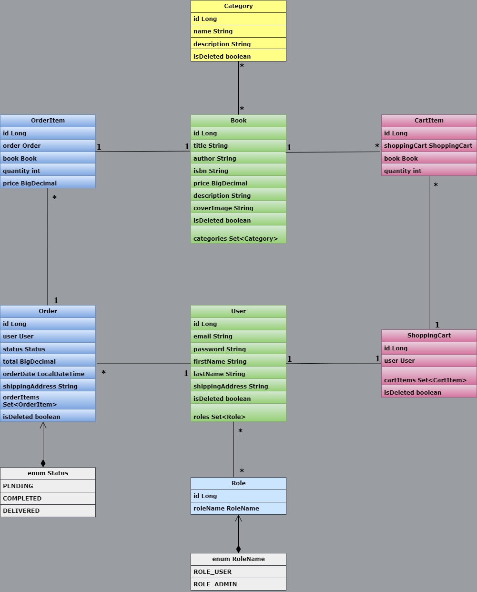

# Book Store
This is Book Store RESTful API to manage online book store. It allows users to browse books, 
manage shopping cart, and create orders. Administrators can control over the book catalog with  
CRUD (Create, Read, Update, Delete) operations with books and other database entities. User can 
create an account and use it for managing it own shopping cart and place orders.


## **Technology stack:**

* **Language:** Java 22
* **Database & ORM:** MySQL 8.0.33, Hibernate 6.6.2.Final
* **Framework:** Spring Boot 3.4.0
* **Web Server:** Tomcat 10.1.33
* **Tools:** JUnit 5.11.3, Mockito 5.14.2, Maven 3.8.6, Test containers 1.20.4, Liquibase 4.29.2, Swagger 2.7.0, Docker 28.3.2

## Instructions

* Clone the [project](https://github.com/Vlad1507/spring-boot-book-store) on your computer.
* Create .env file in the root folder and specify your docker and local ports, add database connection information (you can pull out database from Docker HUB) .
* Run docker
#### Example of .env file
```.env
SPRING_LOCAL_PORT=<insert-your-spring-local-port>
SPRING_DOCKER_PORT=<insert-your-spring-docker-port>

JWT_SECRET=<insert-your-jwt-secret-key>
JWT_EXPIRATION=<insert-your-jwt-expiration>

MYSQL_DATABASE=<insert-your-mysql-database>
MYSQL_USERNAME=<insert-your-mysql-username>
MYSQL_PASSWORD=<insert-your-mysql-password>

MYSQL_ROOT_PASSWORD=<insert-your-mysql-root-password>

MYSQL_LOCAL_PORT=<insert-your-mysql-local-port>
MYSQL_DOCKER_PORT=<insert-your-mysql-docker-port>
DEBUG_PORT=<insert-your-debug-port>
```
* Navigate to the root folder of project and build docker image  
```console
docker build -t your-image-name:tag .
``` 
* Start the docker containers using command:
```console
docker-compose up
```
* Default URI for docker server http://localhost:8081
* For local project usage required are next components:  
  - Java 22 version or newer and Maven 3.8.6 version or newer.
  - The database can be applied from the container (pulled from DockerHUB). 
  - If you run project locally you should use default URI http://localhost:8080

## **Functionalities**
* When application started you can access to Swagger documentation through the URL of your server. 
For example: http://localhost:8081/swagger-ui/index.html to get full information about endpoints.
* There are default admin and two users handled by the Liquibase changelog
[file](src/main/resources/db/changelog/changes/06-insert-users.yaml)
* They are intended for development and testing purposes only without the need to manually 
  register new users.

Admin User
```json
{
 "email": "vo_admin@gmail.com",
 "password": "5o964(6t356ut-a8934yt-34t"
}
```
Regular users
```json
{
 "email": "sam1spam@gmail.com",
 "password": "09)sp_aM31#"
}
```
```json
{
 "email": "vo_admin@gmail.com",
 "password": "noSilA12*-3"
}
```

### Endpoints for unregistered users
* POST:/api/auth/registration - User registration
* POST:/api/auth/login - User authentication

### Endpoints for admin
* #### <code style="color : ORANGERED">Categories</code>
   * POST:/api/categories - Create category
   * PUT:/api/categories/{id} - Update category
   * DELETE:/api/categories/{id} - Delete category

* #### <code style="color : LIGHTGREEN">Books</code>
   * POST:/api/books - Create book
   * PUT:/api/books/{id} - Update existed book
   * DELETE:/api/books/{id} - Delete existed book

* ####  <code style="color : AQUA">Orders</code>
  * PATCH:/api/orders/{orderId} - Update order status

### Endpoints for registered users
* #### <code style="color : ORANGERED">Categories</code>
  * GET:/api/categories/all - Get all categories
  * GET:/api/categories/{id} - Receive category by id
  * GET:/api/categories/{id}/books - Get books by category

* #### <code style="color : LIGHTGREEN">Books</code>
  * GET:/api/books - Receive all books
  * GET:/api/books/{id} - Return book by id
  * GET:/api/books/search - Search book by params

* #### <code style="color : AQUA">Orders</code>
  * POST:/api/orders - Add an order
  * GET:/api/orders - Get order history
  * GET:/api/orders/{orderId}/items - Get page of order items
  * GET:/api/orders/{orderId}/items/{itemId} - Get order item by id

* #### <code style="color : ORANGE">Shopping Cart</code>
  * GET:/api/cart - Get shopping cart
  * POST:/api/cart - Add an item to cart
  * PUT:/api/cart/items/{itemId} - Update item quantity in shopping cart
  * DELETE:/api/cart/items/{itemId} - Delete item from shopping cart

## Collection of Postman requests
For easily work with postman endpoints you can import .json [file](BookStore.postman_collection.json) from root folder.

## Database Schema

